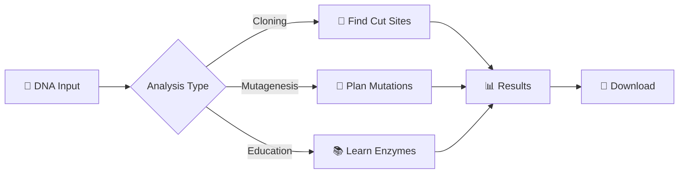

<div align="center">

# 🧬 Mutate for Digest

### Advanced Bioinformatics Tool for Restriction Enzyme Analysis & DNA Mutagenesis Planning

[](https://www.python.org/)
[](https://streamlit.io)
[](https://opensource.org/licenses/MIT)
[](http://makeapullrequest.com)

**A comprehensive web-based application for molecular biologists to design optimal restriction sites and plan site-directed mutagenesis experiments with visual feedback and detailed analysis.**

[Features](#-features) • [Installation](#-installation--usage) • [How It Works](#-how-this-tool-works) • [Documentation](#-input-formats) • [Contributing](#-contributing)


</div>

---

## ✨ Features

<table>
<tr>
<td width="50%">

### 🔬 **Core Functionality**
- 🧬 **Restriction Site Analysis** - Scan DNA sequences for enzyme recognition sites
- 🧪 **Mutation Planning** - Identify optimal positions for introducing new sites
- 🔍 **Protein Impact Assessment** - Analyze how mutations affect protein sequences
- 🎨 **Interactive Visualization** - Color-coded sequence display with enzyme highlights
- 📊 **Dual Translation View** - Compare original vs mutated protein sequences

</td>
<td width="50%">

### 🚀 **Advanced Capabilities**
- 📝 **Multiple Input Methods** - Direct text or FASTA file upload
- ⚙️ **Flexible Parameters** - Linear and circular DNA topology support
- 🗃️ **Custom Enzyme Database** - Add your own restriction enzymes
- ⚡ **Real-time Analysis** - Instant feedback on parameter changes
- 💾 **Professional Output** - Publication-ready formatted results

</td>
</tr>
</table>

---

## 🎯 Why Use This Tool?

<div align="center">

| Problem | Solution |
|---------|----------|
| 🔴 Need to introduce restriction sites but don't know where | ✅ Automatically suggests optimal mutation positions |
| 🔴 Worried about breaking protein function | ✅ Shows exact amino acid changes before you commit |
| 🔴 Manual sequence analysis is time-consuming | ✅ Instant analysis with visual feedback |
| 🔴 Hard to visualize enzyme cut sites | ✅ Interactive color-coded sequence viewer |

</div>

---

## 🛠️ How This Tool Works

<details open>
<summary><b>📋 Complete Workflow (Click to expand/collapse)</b></summary>

### Step 1️⃣: **Input DNA Sequence**
Paste or upload your DNA sequence in FASTA format. The tool automatically cleans and processes your input.
```
>Your_Sequence_Name
ATGCGTACGTAGCTAGCTAGCTAGCGTACGTACGATCGATCG...
```

### Step 2️⃣: **Select Restriction Enzymes**
Choose from the database or enter custom recognition patterns. Each enzyme has a specific DNA sequence it recognizes.

### Step 3️⃣: **Scan for Sites**
The tool searches your DNA for exact matches to restriction sites and displays their positions.

### Step 4️⃣: **Suggest Mutations**
If a site isn't present, the tool finds places where small changes (1-2 nucleotides) could create new sites.

### Step 5️⃣: **Protein Translation**
DNA is translated into amino acid sequences in your chosen reading frame. Mutations and their impacts are clearly shown.

### Step 6️⃣: **Visual Results**
- 📊 Tables with enzyme positions and cut sites
- 🎨 Color-coded sequence views
- 🔬 Mutation highlights
- 🧬 Amino acid change indicators

### Step 7️⃣: **Interactive Sequence Visualization**
- Color-coded nucleotides (A, T, G, C)
- Enzyme labels positioned above cut sites
- Mutation markers with visual highlights
- Side-by-side original vs mutated comparison

### Step 8️⃣: **Mutation Information**
Detailed breakdown showing:
- Which enzyme creates which site
- Exact nucleotide changes required
- Resulting amino acid substitutions
- Position-specific information

### Step 9️⃣: **Download Everything**
Export all results, tables, and sequences for documentation or further analysis.

</details>

---

## 🚀 Installation & Usage

### 📦 Quick Start
```bash
# Clone the repository
git clone https://github.com/yourusername/mutate-for-digest.git
cd mutate-for-digest

# Install dependencies
pip install -r requirements.txt

# Run the application
streamlit run streamlit_app.py
```

Then open your browser and navigate to **`http://localhost:8501`** 🌐

### 🐳 Docker Installation (Optional)
```bash
# Build the Docker image
docker build -t mutate-for-digest .

# Run the container
docker run -p 8501:8501 mutate-for-digest
```

---

## 📋 Requirements
```
streamlit >= 1.28.0
pandas >= 1.5.0
Python >= 3.8
```

<details>
<summary><b>View complete dependencies</b></summary>

- `streamlit` - Web application framework
- `pandas` - Data manipulation and analysis
- `re` (built-in) - Regular expression operations
- `io` (built-in) - File I/O operations
- `base64` (built-in) - Base64 encoding
- `datetime` (built-in) - Date and time handling
- `typing` (built-in) - Type hints support

</details>

---

## 📖 Input Formats

### 🧬 DNA Sequence (FASTA Format)
```fasta
>Your_Sequence_Name
ATGCGTACGTAGCTAGCTAGCTAGCGTACGTACGATCGATCGTAGCTAGCTAG
CGTACGTAGCTAGCTAGCTAGCGTACGTACGATCGATCGTAGCTAGCTAGCGT
ACGATCGATCGTAGCTAGCTAGCGTACGTAGCTAGCTAGCTAGCGTACG
```

### 🔬 Restriction Sites Format
```
/GAATTC/ (EcoRI)1
/AAGCTT/ (HindIII)1
/GGATCC/ (BamHI)1
/CTGCAG/ (PstI)1
/GTCGAC/ (SalI)1
```

**Format:** `/RECOGNITION_SEQUENCE/ (ENZYME_NAME)CUT_POSITION`

---

## 🔬 Output Features

<table>
<tr>
<td>

### 📊 **Sequence Statistics**
- ✅ Total base pairs
- ✅ GC content percentage
- ✅ DNA topology (linear/circular)
- ✅ Number of restriction sites

</td>
<td>

### 📋 **Analysis Results**
- ✅ Found restriction sites table
- ✅ Potential mutation sites
- ✅ Original protein translation
- ✅ Mutated protein translation
- ✅ Detailed mutation information

</td>
</tr>
</table>

### 🎨 Visual Elements

| Element | Description |
|---------|-------------|
| 🔴 **A (Adenine)** | Red colored nucleotide |
| 🔵 **T (Thymine)** | Blue colored nucleotide |
| 🟢 **G (Guanine)** | Green colored nucleotide |
| 🟡 **C (Cytosine)** | Yellow colored nucleotide |
| 🏷️ **Enzyme Labels** | Positioned above cut sites |
| ⭐ **Mutation Markers** | Highlighted backgrounds |
| 🧬 **Protein Changes** | Bold/colored amino acids |

---

## 💡 Use Cases

<div align="center">


</div>

### 🎓 Perfect For:

- **🧬 Molecular Cloning** - Plan restriction digests for gene cloning and vector construction
- **🧪 Site-Directed Mutagenesis** - Design primers for introducing specific restriction sites
- **🔬 Synthetic Biology** - Optimize DNA constructs for standardized assembly methods
- **🔍 Gene Analysis** - Understand restriction patterns in genomic sequences
- **📚 Educational Tool** - Learn about restriction enzymes and their applications
- **🏢 Research Labs** - Streamline cloning workflows and experimental design

---

## 💡 Tips for Best Results

<table>
<tr>
<td>

### ✅ **Do's**
- ✔️ Use high-quality sequences
- ✔️ Check multiple reading frames
- ✔️ Consider codon usage
- ✔️ Download results for records
- ✔️ Validate critical mutations

</td>
<td>

### ❌ **Don'ts**
- ✖️ Use sequences with ambiguous bases
- ✖️ Ignore protein context
- ✖️ Skip experimental validation
- ✖️ Forget to save your work
- ✖️ Overlook enzyme compatibility

</td>
</tr>
</table>

---

## 🎨 Visual Guide

<div align="center">

### Sequence Display Example
```
Position  1: ATGCGTACGTAGCTAGCTAG
             ^^^     ^^^^^^
           EcoRI    BamHI
```

**Legend:**
- 🟥 A = Adenine
- 🟦 T = Thymine  
- 🟩 G = Guanine
- 🟨 C = Cytosine
- 🏷️ Labels = Enzyme names at cut positions
- ⭐ Highlights = Proposed mutations

</div>

---

## 📸 Screenshots

<details>
<summary><b>🖼️ Click to view app screenshots</b></summary>

### Main Interface


### Analysis Results


### Sequence Visualization


</details>

---

## 🤝 Contributing

We love contributions! 💙 Here's how you can help:

<table>
<tr>
<td>

### 🐛 **Report Bugs**
Found a bug? [Open an issue](https://github.com/ShubhamBioIT/mutate-for-digest/issues)

</td>
<td>

### 💡 **Suggest Features**
Have an idea? [Start a discussion](https://github.com/ShubhamBioIT/mutate-for-digest/discussions)

</td>
<td>

### 🔧 **Submit PR**
Want to code? [Create a pull request](https://github.com/ShubhamBioIT/mutate-for-digest/pulls)

</td>
</tr>
</table>

### 📝 Contribution Steps
```bash
# 1. Fork the repository
# 2. Create a feature branch
git checkout -b feature/amazing-feature

# 3. Commit your changes
git commit -m 'Add amazing feature'

# 4. Push to the branch
git push origin feature/amazing-feature

# 5. Open a Pull Request
```

---

## 📄 License

This project is licensed under the **MIT License** - see the [LICENSE](LICENSE) file for details.
```
MIT License - Free to use, modify, and distribute
```

---

## 🙏 Acknowledgments

<div align="center">

| Contribution | Credit |
|--------------|--------|
| 🔬 **Original Concept** | Sequence Manipulation Suite |
| 🎨 **Framework** | Streamlit Team |
| 🧬 **Inspiration** | Molecular Biology Community |
| 💻 **Development** | Open Source Contributors |

</div>

---

## 📞 Support & Contact

<div align="center">

| Channel | Link |
|---------|------|
| 🐛 **Bug Reports** | [GitHub Issues](https://github.com/yourusername/mutate-for-digest/issues) |
| 💬 **Discussions** | [GitHub Discussions](https://github.com/yourusername/mutate-for-digest/discussions) |
| 📧 **Email** | your.email@example.com |
| 🌐 **Website** | [Your Website](https://yourwebsite.com) |

</div>

---

## 🔬 Scientific Background

<details>
<summary><b>📚 Technical Details (Click to expand)</b></summary>

This tool implements sophisticated algorithms for:

- **🔍 Pattern Matching** - Using regular expressions for DNA sequence analysis
- **🧬 Degenerate Nucleotides** - Handling IUPAC ambiguity codes
- **🔬 Genetic Code Translation** - Customizable codon tables
- **🧪 Mutation Impact Analysis** - Protein sequence change prediction
- **📊 Statistical Analysis** - GC content and sequence composition
- **🎯 Optimization Algorithms** - Finding minimal mutation paths

Perfect for researchers in:
- 🧬 Molecular Biology
- 🔬 Genetics
- 🧪 Synthetic Biology
- 💻 Bioinformatics
- 📚 Education

</details>

---

## 📈 Project Status

<div align="center">


</div>

---

## 🗺️ Roadmap

- [x] Basic restriction site analysis
- [x] Mutation suggestion system
- [x] Protein translation
- [x] Interactive visualization
- [ ] Multiple sequence alignment
- [ ] Primer design integration
- [ ] Database connectivity (UniProt, GenBank)
- [ ] Advanced statistics
- [ ] Export to various formats (PDF, CSV)
- [ ] API endpoint support

---

## ⭐ Star History

<div align="center">

[](https://star-history.com/#yourusername/mutate-for-digest&Date)

**If you find this tool helpful, please consider giving it a ⭐!**

</div>

---

<div align="center">

### 🧬 Made with ❤️ for the Scientific Community

**Streamline your molecular cloning workflow with intelligent restriction site analysis and mutagenesis planning**

[⬆ Back to Top](#-mutate-for-digest)

---

**© 2024 Mutate for Digest. All rights reserved.**

</div>
```

---

## 🎁 Bonus: Create these additional files

### Create `requirements.txt`:
```
streamlit>=1.28.0
pandas>=1.5.0
```

### Create `.gitignore`:
```
__pycache__/
*.py[cod]
*$py.class
*.so
.Python
env/
venv/
.venv
*.egg-info/
.DS_Store
.streamlit/
